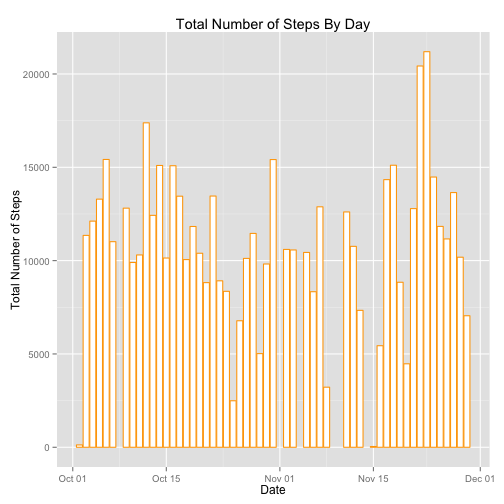
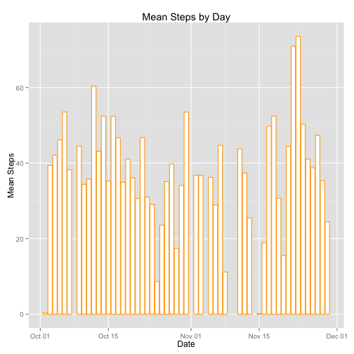

Title
========================================================

This is an R Markdown document. Markdown is a simple formatting syntax for authoring web pages (click the **Help** toolbar button for more details on using R Markdown).

When you click the **Knit HTML** button a web page will be generated that includes both content as well as the output of any embedded R code chunks within the document. You can embed an R code chunk like this:


```r
install.packages("ggplot2")
```

```
## 
## The downloaded binary packages are in
## 	/var/folders/m6/b85mhm8j795531dbs4fdg4dr0000gn/T//Rtmp3MVyYw/downloaded_packages
```

```r
library(ggplot2)
```

```
## Find out what's changed in ggplot2 with
## news(Version == "1.0.0", package = "ggplot2")
```

```r
setwd("~/Documents/Coursera/Reproducible Research/Assignments/Assignment1")
ds<-read.csv("./Data/activity.csv",header=TRUE)
ds$date <- as.Date(ds$date,format = "%Y-%m-%d")
#Plot the histogram for question 1
    ds.sum<-aggregate(ds$steps, by=list(Day=ds$date), FUN=sum)
    colnames(ds.sum)<-c("Date","Steps")
    par(mar=c(5,4,4,2) + 0.1) 
    plot(ds.sum$Date,ds.sum$Steps,type="l",xlab="Date",ylab="Steps",main="Total Steps Taken per Day")
```

 

Average steps taken per day:

```r
#Plot the mean and median total number of steps taken
    ds.mean<-aggregate(steps~date,ds, mean)
    colnames(ds.mean)<-c("Date","Steps")
    par(mar=c(5,4,4,2) + 0.1) 
    meanSteps<-plot(ds.mean$Date,ds.mean$Steps,type="h",xlab="Date",ylab="Avg Steps",main="Average Steps Taken per Day")
```

 

Median steps taken per day:

```r
#Plot the median total number of steps taken
    ds.med<-aggregate(steps~date,data=ds, FUN=median)
    colnames(ds.med)<-c("Date","Steps")
    par(mar=c(5,4,4,2) + 0.1) 
    plot(ds.med$Date,ds.med$Steps,type="h",xlab="Date",ylab="Median Steps",main="Median Steps Taken per Day")
```

 

Average number of steps by 5 minute interval. Judging by the plot below, the highest number of steps occured at around the 830 interval.

```r
#Plot the avg number of steps by interval
    ds.avg<-aggregate(steps~interval,ds, mean)
    colnames(ds.avg)<-c("Interval","Steps")
    ggplot(ds.avg,aes(x=Interval,y=Steps)) + geom_line() + scale_x_continuous(limits=c(0,2400)) +
    ggtitle("Average steps per interval")
```

 

Total number of missing values is:

```r
#Total number of NAs
    missing<-is.na(ds$steps)
    sum(missing)
```

```
## [1] 2304
```

The strategy I came up with is to replace NA values with a zero. The code below replaces NA with zero and creates
a new dataset with the NAs replaced.

```r
#Replace NA with 0
    ds.nm <- ds
    ds.nm[is.na(ds.nm)] <- 0
    ds.nm$date <- as.Date(ds.nm$date,format = "%Y-%m-%d")
```

Here are the mean and median values of the dataset with the NAs replaced:

```r
#Plot the mean and median total number of steps taken
    ds.nm_mean<-aggregate(steps~date,ds.nm, mean)
    colnames(ds.nm_mean)<-c("Date","Steps")
    par(mar=c(5,4,4,2) + 0.1)     
    naReplaced<-plot(ds.nm_mean$Date,ds.nm_mean$Steps,type="h",xlab="Date",ylab="Avg Steps",main="Average Steps Taken per Day")
```

 

```r
#Plot the median total number of steps taken
    ds.nm_med<-aggregate(steps~date,data=ds.nm, FUN=median)
    colnames(ds.nm_med)<-c("Date","Steps")
    par(mar=c(5,4,4,2) + 0.1) 
    plot(ds.nm_med$Date,ds.nm_med$Steps,type="h",xlab="Date",ylab="Avg Steps",main="Average Steps Taken per Day")
```

 

Looking for differences between weekday and weekend.
First, create a new factor variable for weekday and weekend

```r
#Get weekdays and weekends
    ds.ww <- ds
    ds.ww[is.na(ds.ww)] <- 0
    ds.ww$date <- as.Date(ds.nm$date,format = "%Y-%m-%d")
    ds.ww$date <- weekdays(ds.ww$date, abbreviate = FALSE)
    
    ds.weekday<-ds.ww[(ds.ww$date %in% c("Monday","Tuesday","Wednesday","Thursday","Friday")),]
    ds.weekend<-ds.ww[(ds.ww$date %in% c("Saturday","Sunday")),]
    
    ds.weekday$date <- as.factor(ds.weekday$date)
    ds.weekend$date <- as.factor(ds.weekend$date)
```

Next, create a panel plot to show the difference between weekday and weekend.

```r
    ds.ww_avg<-aggregate(steps~interval,ds.weekday, mean)
    colnames(ds.ww_avg)<-c("Interval","Steps")
    week_plot<-ggplot(ds.ww_avg,aes(x=Interval,y=Steps)) + geom_line() + scale_x_continuous(limits=c(0,2400)) + 
    ggtitle("Avg steps by interval for weekday")

    ds.ww_avg<-aggregate(steps~interval,ds.weekend, mean)
    colnames(ds.ww_avg)<-c("Interval","Steps")
    weekend_plot<-ggplot(ds.ww_avg,aes(x=Interval,y=Steps)) + geom_line() + scale_x_continuous(limits=c(0,2400)) +
        ggtitle("Avg steps by interval for weekend")

    install.packages("gridExtra")
```

```
## 
## The downloaded binary packages are in
## 	/var/folders/m6/b85mhm8j795531dbs4fdg4dr0000gn/T//Rtmp3MVyYw/downloaded_packages
```

```r
    library(gridExtra)
```

```
## Loading required package: grid
```

```r
    grid.arrange(week_plot,weekend_plot)
```

 
