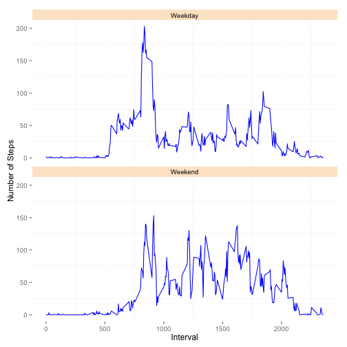

Reproducible Research - Assignment 1
====================================
###Loading and preprocessing the data

Load the libraries required to complete this assignment:

```r
    library(ggplot2)
    library(plyr)
```

Retrieve the dataset and transform

```r
  #Retrieve the dataset and stored in a staging variable
    dsCSV <- read.csv("Data/activity.csv",header=TRUE)
  #Store the data in variable to be worked on
    ds <- dsCSV
  #format ds$date to a date data type
    ds$date <- as.Date(ds$date,format="%Y-%m-%d")
```

###What is mean total number of steps taken per day?
The mean total number of steps taken per day:

```r
  #Calculate the total number of the steps taken per day and store in the mm variable
    mm <- ddply(ds,"date",summarise,totalSteps = sum(steps))
  #Plot the total number of steps taken in a histogram:
    plotNumSteps <- ggplot(mm,aes(x=date,y=totalSteps)) + geom_bar(stat="identity",fill="white", colour="orange") 
    plotNumSteps + xlab("Date") + ylab("Total Number of Steps") + ggtitle("Total Number of Steps By Day")
```

```
## Warning: Removed 8 rows containing missing values (position_stack).
```

 

The mean steps taken by day. Here is a summary and a plot:


```r
  meanStepsPerDay <- ddply(ds,"date",summarise,meanSteps = mean(steps))
  summary(meanStepsPerDay)
```

```
##       date              meanSteps    
##  Min.   :2012-10-01   Min.   : 0.14  
##  1st Qu.:2012-10-16   1st Qu.:30.70  
##  Median :2012-10-31   Median :37.38  
##  Mean   :2012-10-31   Mean   :37.38  
##  3rd Qu.:2012-11-15   3rd Qu.:46.16  
##  Max.   :2012-11-30   Max.   :73.59  
##                       NA's   :8
```

```r
  #Calculate and report the mean and median total number of steps taken per day
  #Calculate mean steps with NA
    meanStepsPerDay <- ddply(ds,"date",summarise,meanSteps = mean(steps))
    plotMeanSteps<-ggplot(meanStepsPerDay,aes(x=date,y=meanSteps)) + geom_bar(stat="identity",fill="white", colour="orange")
    plotMeanSteps + xlab("Date") + ylab("Mean Steps") + ggtitle("Mean Steps by Day")
```

```
## Warning: Removed 8 rows containing missing values (position_stack).
```

 

```r
    summary(meanStepsPerDay)
```

```
##       date              meanSteps    
##  Min.   :2012-10-01   Min.   : 0.14  
##  1st Qu.:2012-10-16   1st Qu.:30.70  
##  Median :2012-10-31   Median :37.38  
##  Mean   :2012-10-31   Mean   :37.38  
##  3rd Qu.:2012-11-15   3rd Qu.:46.16  
##  Max.   :2012-11-30   Max.   :73.59  
##                       NA's   :8
```

The median steps taken by day. Here is a summary and a plot:


```r
  #Calculate median steps with NA
    medianStepsPerDay <- ddply(ds,"date",summarise,medianSteps = median(steps))
    summary(medianStepsPerDay)
```

```
##       date             medianSteps
##  Min.   :2012-10-01   Min.   :0   
##  1st Qu.:2012-10-16   1st Qu.:0   
##  Median :2012-10-31   Median :0   
##  Mean   :2012-10-31   Mean   :0   
##  3rd Qu.:2012-11-15   3rd Qu.:0   
##  Max.   :2012-11-30   Max.   :0   
##                       NA's   :8
```

```r
    plotMedSteps<-ggplot(medianStepsPerDay,aes(x=date,y=medianSteps)) + geom_bar(stat="identity")
    plotMedSteps + xlab("Date") + ylab("Median Steps") + ggtitle("Median Steps by Day")
```

```
## Warning: Removed 8 rows containing missing values (position_stack).
```

 

###What is the average daily activity pattern?

```r
  #Make a time series plot (i.e. type = "l") of the 5-minute interval (x-axis) and the 
  #average number of steps taken, averaged across all days (y-axis)
    #Calculate mean steps by interval
      meanStepsPerInterval <- ddply(ds,"interval",summarise,meanStepsByInterval = mean(steps,na.rm=TRUE))
    #Plot the line
      plotMeanByInterval<-ggplot(meanStepsPerInterval,aes(x=interval,y=meanStepsByInterval)) + geom_line()
      plotMeanByInterval + xlab("Interval") + ylab("Mean Steps") + ggtitle("Average Number of Steps by Interval")
```

 

The Interval with the highest average number of steps is: 

```r
    stepsPerInterval <- aggregate( steps~interval, ds, mean)
    tail(stepsPerInterval[order(stepsPerInterval$steps),],1)
```

```
##     interval steps
## 104      835 206.2
```

###Imputing missing values
The number of missing values is 2304 

```r
    #A.Calculate and report the total number of missing values in the dataset (i.e. the total number of rows with NAs)
      sum(is.na(dsCSV))
```

```
## [1] 2304
```

A strategy for replacing the NA values is to change them into a zero.


```r
  #C.Create a new dataset that is equal to the original dataset but with the missing data filled in.
      dsReplaced<-replace(dsCSV,is.na(dsCSV),0)
      head(dsReplaced)
```

```
##   steps       date interval
## 1     0 2012-10-01        0
## 2     0 2012-10-01        5
## 3     0 2012-10-01       10
## 4     0 2012-10-01       15
## 5     0 2012-10-01       20
## 6     0 2012-10-01       25
```

```r
      head(dsCSV)
```

```
##   steps       date interval
## 1    NA 2012-10-01        0
## 2    NA 2012-10-01        5
## 3    NA 2012-10-01       10
## 4    NA 2012-10-01       15
## 5    NA 2012-10-01       20
## 6    NA 2012-10-01       25
```
Total number of steps taken per day without the missing values:

```r
    library(plyr)
      mm <- ddply(dsReplaced,"date",summarise,totalSteps = sum(steps))
      plotNumStepsNoNA<-ggplot(mm,aes(x=date,y=totalSteps)) + geom_bar(stat="identity")
      plotNumStepsNoNA + xlab("Date") + ylab("Total Steps") + ggtitle("Total Number of Steps by Day (No missing values)")
```

 

Plot of mean without missing values:

```r
      #mean without NA
        meanStepsPerDayNoNA <- ddply(ds,"date",summarise,meanSteps = mean(steps,na.rm=TRUE))
        plotMeanNoNA <- ggplot(meanStepsPerDayNoNA,aes(x=date,y=meanSteps)) + geom_bar(stat="identity",fill="white", colour="orange")
        plotMeanNoNA + xlab("Date") + ylab("Mean steps") + ggtitle("Mean Steps per Day(No missing values)")
```

```
## Warning: Removed 8 rows containing missing values (position_stack).
```

 

Plot of median without missing values:

```r
      #Calculate median steps with NA
        medianStepsPerDayNoNA <- ddply(ds,"date",summarise,medianSteps = median(steps))
        plotMedNoNA <- ggplot(medianStepsPerDayNoNA,aes(x=date,y=medianSteps)) + geom_bar(stat="identity")
        plotMedNoNA + xlab("Date") + ylab("Median steps") + ggtitle("Median Steps per Day(No missing values)")
```

```
## Warning: Removed 8 rows containing missing values (position_stack).
```

 

###Are there differences in activity patterns between weekdays and weekends?
Here is a plot of the average number of steps taken by weekday and weekend

```r
    #Reformat the date
      dsReplaced$date <- as.Date(dsReplaced$date,format="%Y-%m-%d") 
    #Create a another column in the data frame to hold a value for weekday/weekend
      dsReplaced[,4] <- weekdays(dsReplaced$date)
    #Rename the columns
      colnames(dsReplaced) <- c("steps","date","interval","isWeekDay")
    #Identify weekdays and weekends  
      dsReplaced$isWeekDay[dsReplaced$isWeekDay %in% c("Monday","Tuesday","Wednesday","Thursday","Friday")] <- c("Weekday")
      dsReplaced$isWeekDay[dsReplaced$isWeekDay %in% c("Saturday","Sunday")] <- c("Weekend")
    #Change the isWeekDay column to a factor
    dsReplaced$isWeekDay <- as.factor(dsReplaced$isWeekDay)
  #Make a panel plot containing a time series plot (i.e. type = "l") of the 5-minute interval (x-axis) and 
  #the average number of steps taken, averaged across all weekday days or weekend days (y-axis). The plot 
  #should look something like the following, which was creating using simulated data:
    #Calculate the mean by day type(weekday vs weekend) by interval
      plots<-aggregate(dsReplaced$steps,by=list(dsReplaced$isWeekDay,dsReplaced$interval),FUN=mean)
    #Rename the columns    
      colnames(plots) <- c("isWeekDay","interval","steps")
    #Create the plot using facet_wrap  
      sp <- ggplot(plots, aes(x=interval, y=steps)) + geom_line(col="blue")
      sp + facet_wrap( ~isWeekDay,ncol=1) + xlab("Interval") + ylab("Number of Steps") + theme(panel.background = element_rect(fill = "white"),strip.background = element_rect(fill="#fce6cd"))
```

 
